# Creació del servidor de compartició de fitxers (NAS)

Per a aquesta opció he triat el servidor OMV que ens ofereix una solució molt pràctica, lleugera i fàcil d'administrar de tots els recursos SMB/CIFS que vulguem compartir a la nostra xarxa.

## Instal·lació de la MV

1. Davallar la darrera [ISO](https://www.openmediavault.org/?page_id%3D77) estable de l'OMV mitjançant el GUI de Proxmox
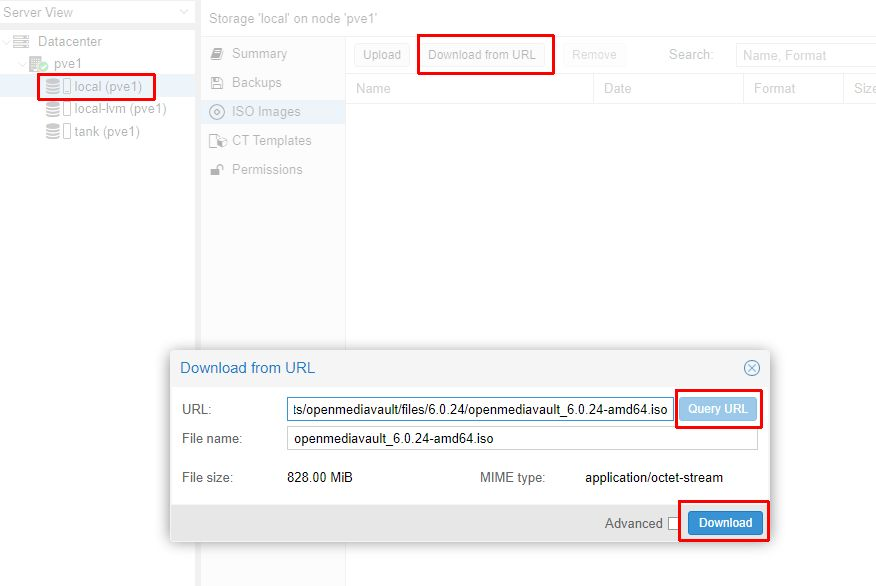
2. Creació d'una MV d'OMV
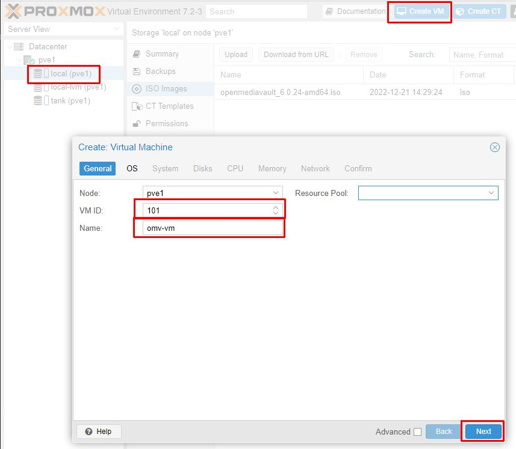
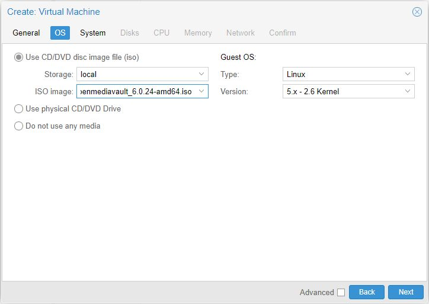
<b>Important!</b> Afegirem un disc més amb l'ubicació del disc de 6TB i triarem la quantitat que vulguem assignar-li. En aquest cas 5TB
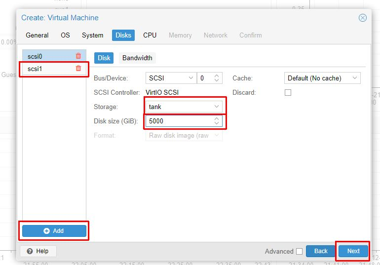
La resta per defecte.

## Configuració de l'OMV

1. Engegar la màquina
2. Fer les configuracions d'idioma, xarxa, contrasenya, localització, partició, ... pertinents
3. Entrar al entorn gràfic a la URL amb usuari "admin", contrasenya "openmediavault"
4. Crear el disc, donar-li format i montar-lo
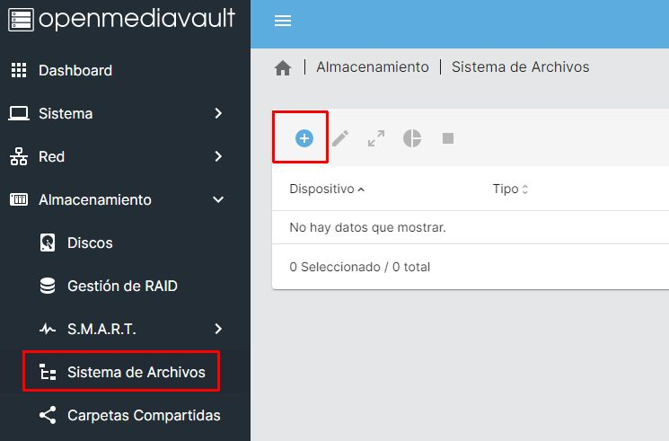
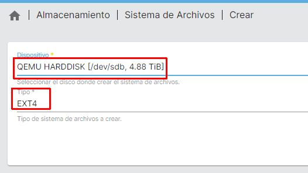
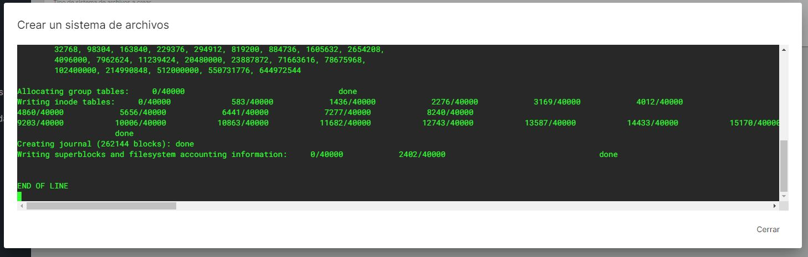
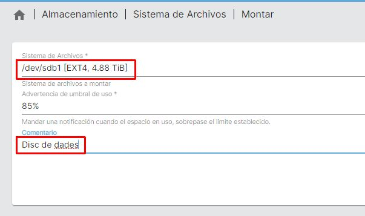
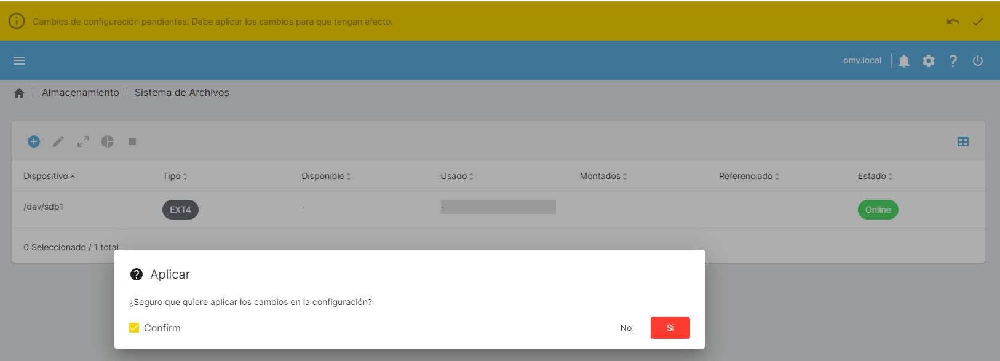
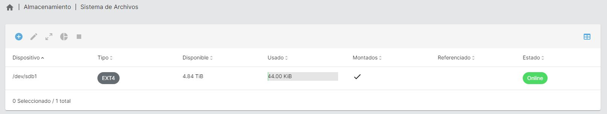
5. Crear carpetes compartides 
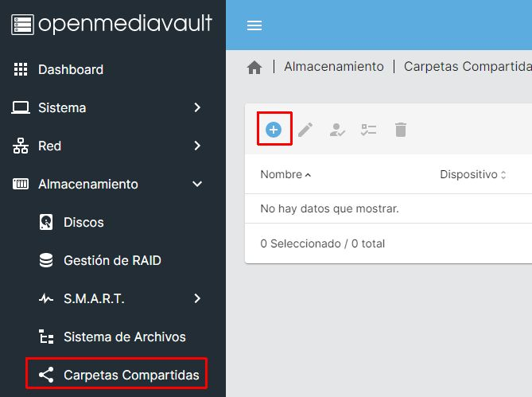
<b>Important!</b> Aquí hem de sel·leccionar que tots els usuaris puguin llegir i escriure
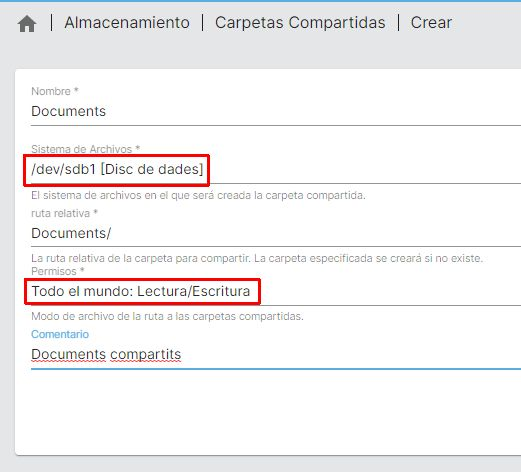

6. Assignació de permisos
Per això hem d'anar a Servicios/SMB/CIFS/Configuración
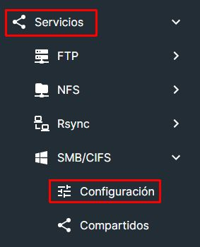
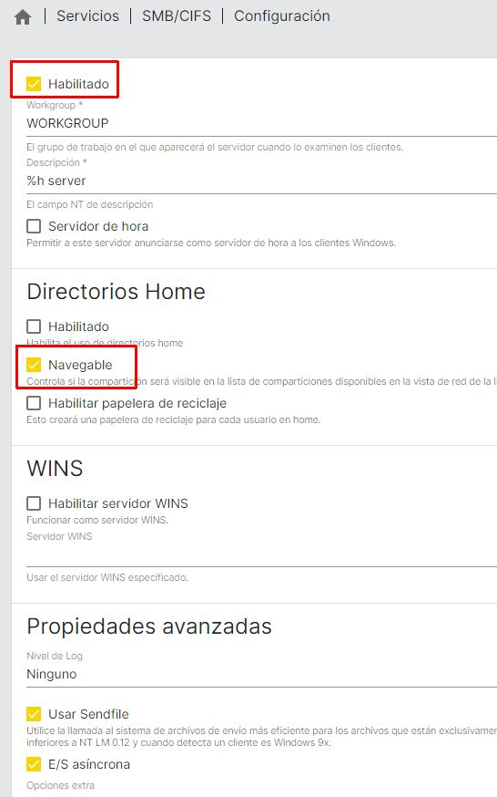
Després hem d'anar a Servicios/SMB/CIFS/Compartidos
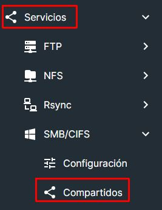
<b>Important!</b> Si volem tenir les carpetes compartides sense restriccions i que es pugui entrar sense demanar contrasenya hem d'habilitar a Público, Invitados solamente
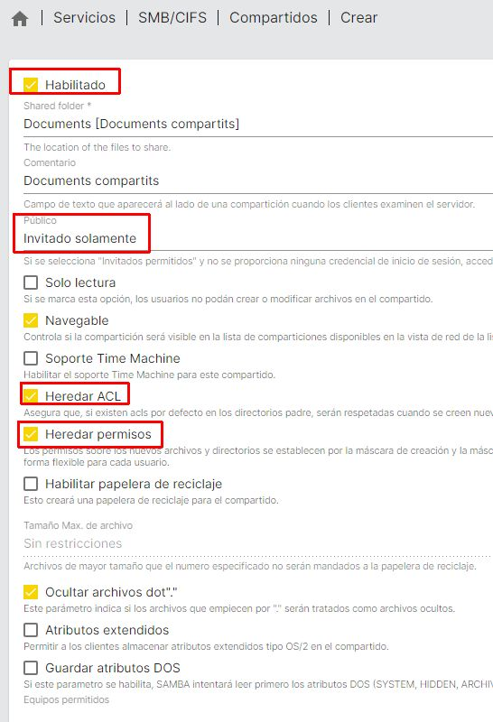

Finalment ja tindrem el recurs compartit de manera que es pot llegir i escriure des de qualsevol dispositiu de la xarxa interna i no es demana usuari ni contrasenya. És més insegur, però suposarem (suposit totalment erroni i representa una escletxa de seguretat, però que assumim en pro de no haver de posar usuari/contrasenya als dispositius de la casa) que la xarxa interna és segura.
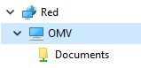