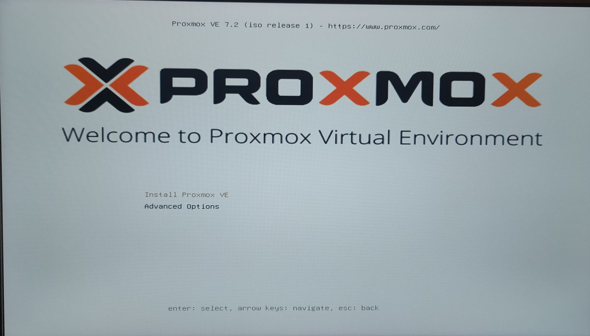
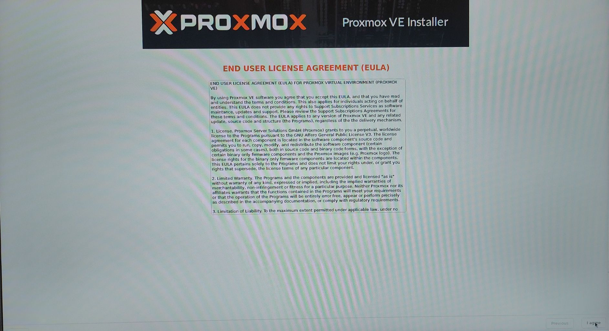
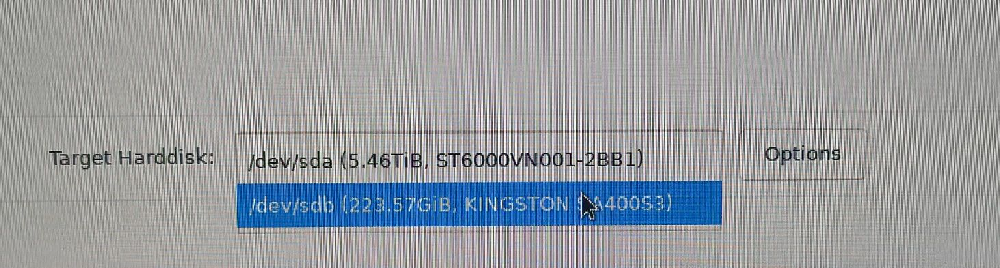
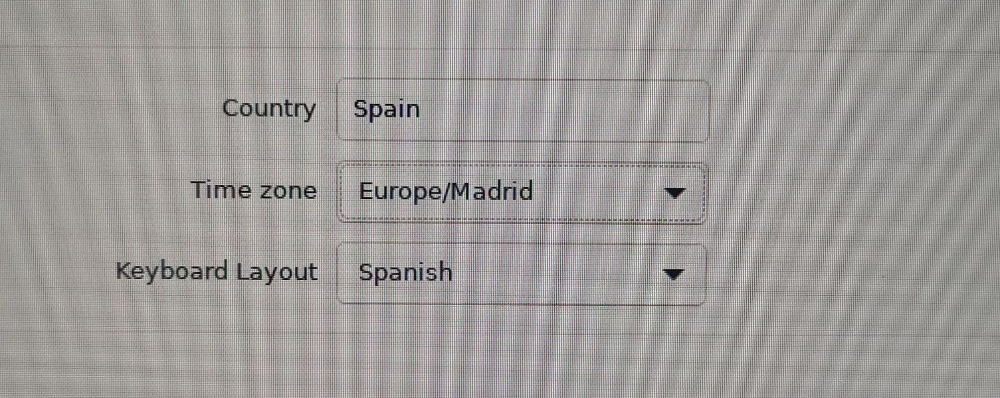
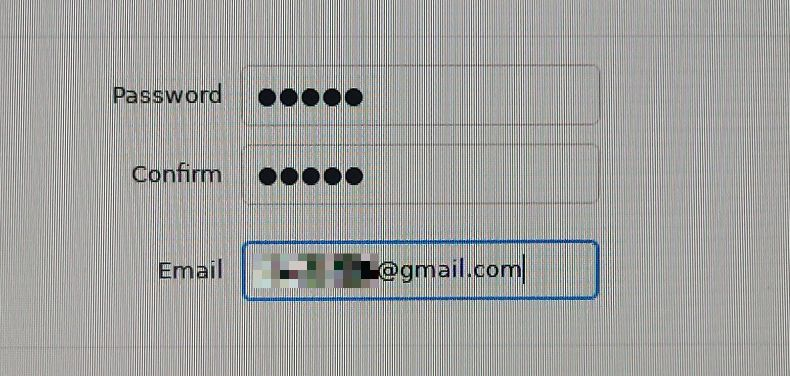
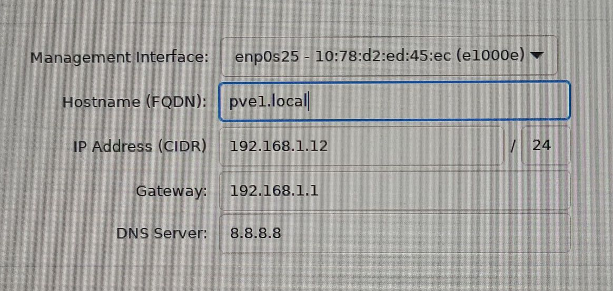

# Instal·lació de Proxmox

1. Descarregar la [ISO ](https://www.proxmox.com/en/downloads/item/proxmox-ve-7-3-iso-installer) de la web
2. Montar la ISO amb [rufus](https://rufus.ie/es/)/[balena](https://www.balena.io/etcher/) a un pendrive
3. Engegar el PC/Servidor amb el pendrive
4. Triar les següents opcions:
    
    
    
    
    
    

Un cop instal·lat, llevam el pendrive, reiniciam i ja podrem entrar a Proxmox