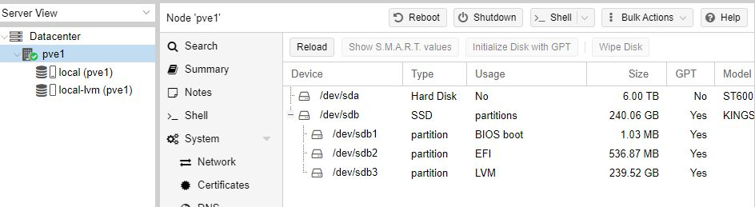
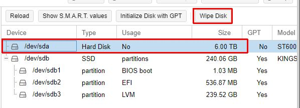
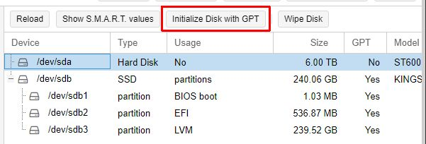
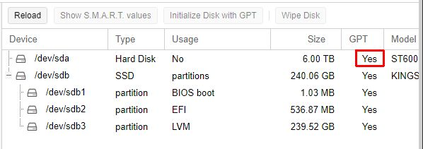
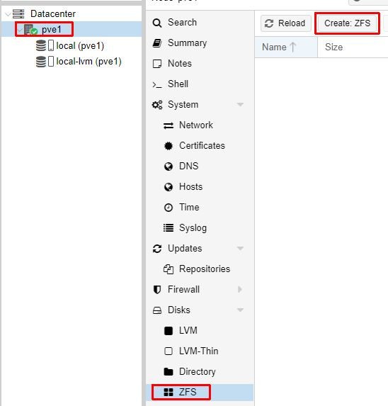
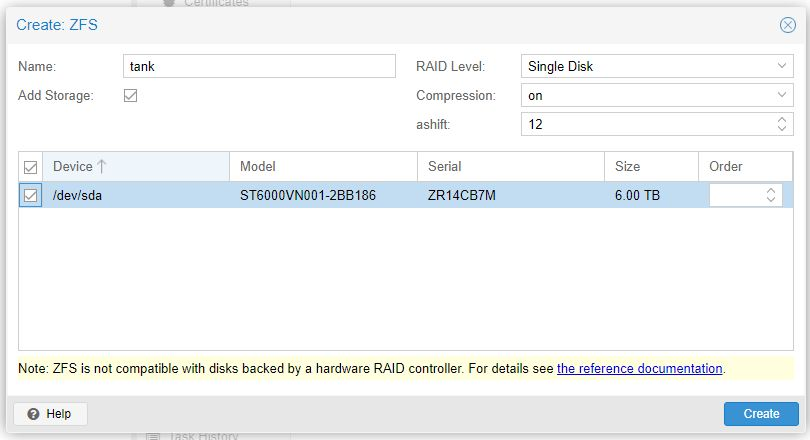
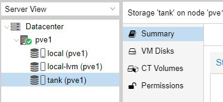
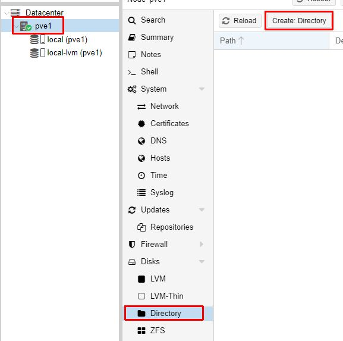
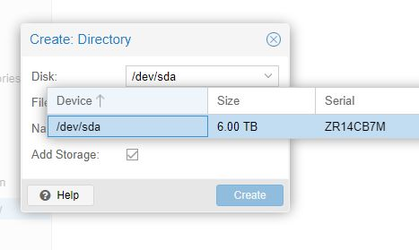
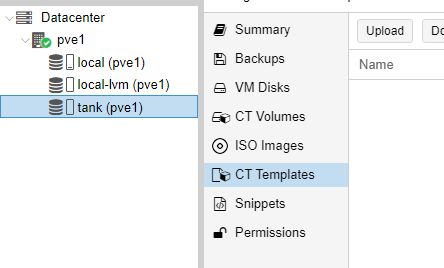

# Instal·lació d'un disc dur

Un cop hem imstal·lat un Proxmox, és possible que ens interessi afegir un disc més gran, ja sia per guardar ISOs, templates, backups o com en aquest cas, espai per fer de NAS. Sigui pel motiu que sigui, podem afegir un disc que haguem instal·lat al servidor de la següent forma:

1. Anam al node pve i sel·leccionam Disks
2. Sel·leccionam el disc que volem afegir

3. Li feim un Wipe

4. L'inicialitzam

Ara ja tenim el disc inicialitzat i Proxmox el pot reconeixer

En aquest punt hem de tenir present per a què farem servir el disc que acabam d'instal·lar. 
- Si el volem per instal·lar-hi damunt VM, CT, fitxers qcow2, la millor opció és crear un disc ZFS. Com podem veure, només ens deixa encabir aquests tipus de dades:

- Si el que volem és instal·lar qualasevol tipus de dades, podem triar Directory malgrat ja ens avisen que no és tan ràpid.

En el meu cas el vull per contenir les dades del NAS. No estic segur que ZFS no ho permeti, però sí sé segur que Directory sí ho permet. Segons la múltiple documentació a [Internet](https://forum.proxmox.com/threads/proxmox-zfs-used-also-as-nas-samba-share.119283/), és possible emprar un ZFS pool pel que vull. Així doncs, farem aquest disc de forma experimental en ZFS. 

>I have create a postgresql container with the blackmagic davinci video project server and a container samba mounting the shared folder on the zfs.

Font: [Proxmox forums 2022](https://forum.proxmox.com/threads/proxmox-zfs-used-also-as-nas-samba-share.119283/)

